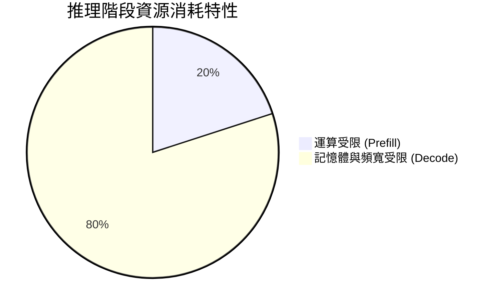

## 摘要

本文章探討了大型語言模型（LLM）推理擴展（Inference Scaling）所面臨的系統瓶頸、權衡與效能原則。隨著推論模型從標準的生成式 AI 轉向以推理為中心的架構（如產生大量思維鏈 Chain-of-Thought 的模型），系統需求發生了根本性的典範轉移。傳統工作負載主要受限於運算密集的預填充（Prefill）階段，而推理工作負載則因為產生冗長的推理 tokens，使得推論過程轉變為「容量受限（Capacity-Bound）」的模式。本文將分析這些架構上的瓶頸，並針對小模型與大模型探討三種主流的平行化擴展策略方案。

## 預填充（Prefill）與解碼（Decode）資源需求分歧

傳統的推論工作負載通常被視為單一工作，但實際上預填充與解碼階段在硬體資源的消耗上有著極端的分歧。

### 1. 受限於運算的預填充階段 (Compute-Bound Prefill)
在此階段，模型並行處理輸入 prompt 的所有 token。這是一個高度依賴矩陣乘法（GEMMs）的過程，算術強度（Arithmetic Intensity）高，能有效利用 GPU 的運算能力（高 SM 佔用率），但對 HBM 記憶體頻寬的使用率相對較低。

### 2. 受限於記憶體與頻寬的解碼階段 (Memory/Bandwidth-Bound Decode)
自迴歸生成的解碼階段，每次生成一個 token 都需要載入整個模型權重與不斷增長的 KV Cache。對於具有長推理鏈的模型（例如 Output Sequence Length 遠大於 Input Sequence Length），此階段算術強度急遽下降，GPU 將大量時間花費在記憶體讀取上。

## 容量陷阱與推理懸崖 (Capacity Trap & Reasoning Cliff)

當長推理生成的 KV Cache 快速增長並耗盡 GPU 的 HBM 容量時，系統便會遇到「容量陷阱」。為了避免 OOM (Out of Memory)，排程器會強制暫停 (Preempt) 部分請求，這會導致極大的重新運算 (Re-computation) 成本。

| 架構類型 | 特性 | 對 HBM 的壓力 |
| --- | --- | --- |
| **密集模型 (Dense)** | 如 Llama-3.1-405B，所有參數參與運算，KV Cache 消耗極大（例如 1.05 MB/token）。 | 容量壓力極大，容易遇到推理懸崖。 |
| **稀疏模型 (Sparse MoE)** | 如 DeepSeek-R1-671B，使用 MLA 壓縮 KV Cache，但受限於路由與同步延遲。 | 容量壓力相對較低，但對通訊同步敏感。 |

## 三種平行化解決方案與評估

為了突破上述瓶頸，系統架構通常需要採取不同的平行化策略。以下提出三種解決方案：

### 方案一：資料平行化 (Data Parallelism, DP)

將模型複製到多個 GPU 上，每個 GPU 獨立處理不同的請求流。

- **優點 (Pros)**: 沒有 GPU 間的通訊開銷，適合小模型與高吞吐量需求。
- **缺點 (Cons)**: 每個 GPU 都要複製一份完整的模型權重，導致可用於 KV Cache 的 HBM 大幅減少，極易觸發容量陷阱（KV Fragmentation）。
- **成本 (Costs)**: 需要較多的獨立記憶體空間，記憶體成本高。
- **維護性 (Maintainability)**: 部署簡單，不涉及複雜的跨卡同步機制。
- **風險 (Risks)**: 在處理長推論請求時，容易因為 KV 耗盡而導致排程器發生頻繁的搶占與重算，嚴重拖累長尾延遲（Tail Latency）。

### 方案二：張量平行化 (Tensor Parallelism, TP)

將模型的單一網路層切分並分散至多個 GPU 上，共同利用所有 GPU 的 HBM 總量。

- **優點 (Pros)**: 不需要複製模型權重，能釋放大量 HBM 給 KV Cache 使用，大幅推遲容量陷阱的發生；對於密集大模型能聚合記憶體頻寬。
- **缺點 (Cons)**: 引入了極高頻率的 All-Reduce 通訊開銷。
- **成本 (Costs)**: 高度依賴節點內的高速互連網路（如 NVLink），硬體網路成本極高。
- **維護性 (Maintainability)**: 需要深入修改運算圖與通訊機制，維護複雜度較高。
- **風險 (Risks)**: 若模型的計算與通訊比例（Compute-to-Communication Ratio）較低（例如 Sparse MoE 模型），通訊開銷將會超越容量釋放帶來的好處。

### 方案三：混合平行化 (Hybrid Parallelism, e.g., PP + TP)

結合管線平行化（Pipeline Parallelism, PP）與張量平行化（TP），將模型按層級切割（PP），同時在層內進行張量切分（TP）。

- **優點 (Pros)**: 能夠在「釋放記憶體容量」與「降低通訊開銷」之間取得最佳平衡，特別適合如 DeepSeek-R1 等超大型稀疏（MoE）模型。
- **缺點 (Cons)**: 容易產生 Pipeline Bubble（管線氣泡/閒置時間），若缺乏足夠的 micro-batches 則會導致運算資源閒置。
- **成本 (Costs)**: 需要極為複雜的叢集排程器與強大的跨節點網路架構。
- **維護性 (Maintainability)**: 維護與除錯困難度最高，需要深入了解硬體拓樸與模型切分的對應關係。
- **風險 (Risks)**: 若微批次（Micro-batch）大小設定不當，將導致嚴重的運算資源閒置；針對不同模型架構需要客製化的調校。
